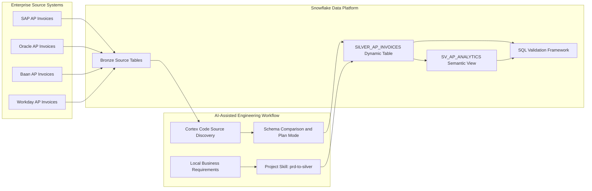
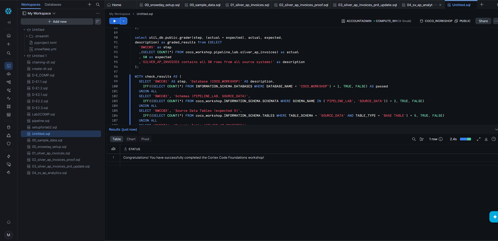

# Snowflake CoCo Foundations: AI-Assisted AP Data Pipeline

> A multi-source Snowflake data engineering implementation combining Cortex Code, Dynamic Tables, local business requirements, reusable AI engineering skills, semantic modelling, and automated system validation.

## Recruiter Snapshot

| Area | Implementation |
|---|---|
| Cloud platform | Snowflake |
| AI engineering tool | Snowflake Cortex Code / CoCo |
| Data sources | SAP, Oracle, Baan, and Workday AP invoices |
| Core pipeline object | `SILVER_AP_INVOICES` Dynamic Table |
| Transformation approach | Multi-source schema mapping and normalisation |
| Change-management input | Local CSV business-requirement files |
| Reusable automation | Project-level `prd-to-silver` Cortex Code skill |
| Analytical layer | `SV_AP_ANALYTICS` semantic view |
| Validation | SQL control wrapper covering infrastructure, source systems, pipeline objects, and record integrity |
| Final result | Successful completion with 50 validated records from all four source systems |

---

## Executive Summary

This project demonstrates how an AI-assisted engineering workflow can be used to design, extend, operate, and validate a Snowflake data pipeline without treating generated code as a black box.

The implementation consolidates accounts-payable invoice data from four enterprise source systems:

- SAP
- Oracle
- Baan
- Workday

These sources use different field names, structures, and business conventions. I used Snowflake Cortex Code through both Snowsight and the Windows CLI to inspect the source schemas, identify equivalent business fields, surface unresolved assumptions, generate implementation plans, and build a shared Silver-layer data model.

The pipeline was then extended using local business-requirement files. Instead of relying only on one-off prompts, I created a reusable project-level Cortex Code skill that converts PRD-style inputs into structured engineering outputs such as mapping summaries, DDL change plans, open questions, and validation queries.

The completed implementation passed the supplied structural validation framework and returned:

```text
Congratulations! You have successfully completed the Cortex Code Foundations workshop!
```

---

## Business Problem

Accounts-payable information is commonly distributed across multiple ERP platforms.

Each source system may represent the same business concepts differently:

- Different invoice identifiers
- Different vendor-field names
- Different status values
- Different date formats
- Different currency conventions
- Different datatype definitions
- Source-specific fields that may not exist elsewhere

Without a normalised data layer, analysts and downstream applications must repeatedly rebuild this logic.

This project solves that problem by creating one trusted Silver-layer Dynamic Table that standardises invoice records from SAP, Oracle, Baan, and Workday into a shared structure.

---

## Architecture



---

## End-to-End Engineering Flow

```text
Enterprise invoice sources
        ↓
Bronze source tables in Snowflake
        ↓
Cortex Code source discovery
        ↓
Schema comparison and assumption review
        ↓
Plan Mode implementation review
        ↓
Silver-layer Dynamic Table
        ↓
Local PRD and mapping analysis
        ↓
Reusable project-level Cortex Code skill
        ↓
Four-source pipeline update
        ↓
Semantic analytical layer
        ↓
Automated structural validation
```

---

# Implementation

## 1. Snowflake Environment Provisioning

The setup scripts create the workshop environment and source data required by the pipeline.

Objects include:

```text
COCO_WORKSHOP
├── SOURCE_DATA
└── PIPELINE_LAB
```

The environment also contains a Snowflake virtual warehouse and supporting validation objects.

### Setup scripts

```text
snowflake-coco-foundations/sql/00_setup/
├── 00_snowday_setup.sql
└── 00_sample_data.sql
```

The source-data schema contains the four AP invoice systems and the workshop evaluation dataset.

```text
BRONZE_SAP_AP_INVOICES
BRONZE_ORACLE_AP_INVOICES
BRONZE_BAAN_AP_INVOICES
BRONZE_WORKDAY_AP_INVOICES
AGENT_EVAL_SET
```

---

## 2. Cortex Code CLI Configuration

Snowflake Cortex Code was installed and configured locally on Windows.

It was used from the project directory so it could work with both:

- Snowflake database objects
- Local project and business-requirement files

The CLI workflow supported:

- Snowflake catalogue discovery
- Natural-language schema investigation
- SQL generation
- Execution-plan review
- Local CSV analysis
- Built-in Snowflake skills
- Project-level custom skills
- Engineering runbook generation

Cortex Code did not replace validation or engineering judgement. Plans, assumptions, generated SQL, mappings, and outputs were reviewed before being accepted.

---

## 3. Source Discovery and Schema Comparison

Before creating the pipeline, Cortex Code was used to inspect the available source tables and compare SAP and Oracle invoice schemas.

The comparison focused on:

- Equivalent fields with different names
- Datatype differences
- Required default values
- Source-specific attributes
- Fields requiring normalisation
- Ambiguities that should remain open questions

This step prevented silent assumptions from being embedded directly into the transformation logic.

### Engineering principle

```text
Discover → compare → document assumptions → review plan → execute
```

This is more reliable than generating transformation SQL before understanding the source contracts.

---

## 4. Silver-Layer Dynamic Table

The primary curated pipeline object is:

```text
COCO_WORKSHOP.PIPELINE_LAB.SILVER_AP_INVOICES
```

The initial implementation combined SAP and Oracle invoice records into a shared analytical schema.

The pipeline applies:

- Source-system identification
- Column-name alignment
- Datatype normalisation
- Common invoice-field mapping
- Reusable transformation logic
- Dynamic Table refresh management
- Source-level validation

### Pipeline files

```text
snowflake-coco-foundations/sql/01_pipeline/
├── 01_silver_ap_invoices.sql
├── 02_silver_ap_invoices_proof.sql
└── 03_silver_ap_invoices_prd_update.sql
```

The proof query groups the final records by `SOURCE_SYSTEM`, providing a fast and repeatable way to verify source coverage after future changes.

---

## 5. Dynamic Table Operations Runbook

The project uses Snowflake’s bundled Dynamic Tables skill to produce operational guidance for the Silver-layer object.

The resulting runbook covers:

- Recommended `TARGET_LAG`
- Current Dynamic Table state
- Refresh-history queries
- Lag monitoring
- Refresh failures
- Staleness patterns
- Operational best practices

### Runbook location

```text
snowflake-coco-foundations/notes/01-dynamic-table-runbook.md
```

This converts the implementation from a code-only artifact into an operable data product with documented monitoring considerations.

---

## 6. PRD-Driven Pipeline Evolution

The original Silver pipeline was extended using local business-requirement files.

### Requirement inputs

```text
snowflake-coco-foundations/requirements/
├── sample_business_requirements_source_onboarding.csv
├── sample_business_requirements_column_mapping.csv
└── sample_business_requirements_business_rules.csv
```

These files introduced:

- Baan as an additional source
- Workday as an additional source
- New source-to-target mappings
- Additional transformation requirements
- Business-rule changes
- Open engineering questions

Cortex Code analysed the requirements and returned:

1. A change summary
2. Source-to-Silver mappings
3. Assumptions and unresolved questions
4. A DDL delta plan
5. Post-implementation validation queries

The updated pipeline therefore integrates all four source systems:

```text
SAP
Oracle
Baan
Workday
```

---

## 7. Reusable `prd-to-silver` Project Skill

A custom project-level Cortex Code skill was created under:

```text
snowflake-coco-foundations/.cortex/skills/prd-to-silver/
```

The skill transforms a repeated engineering process into a reusable workflow.

### Inputs

```text
prd_path
target_dynamic_table
```

### Standard outputs

```text
1. Requested-change summary
2. Source-to-target mapping summary
3. Open questions and assumptions
4. Dynamic Table DDL change plan
5. Post-implementation validation queries
```

### Why this matters

Without the skill, every future PRD could generate a differently structured response.

The project-level skill creates a consistent engineering contract for evaluating requirements and planning Snowflake pipeline changes.

It also makes the workflow reusable by another engineer who clones the repository.

---

## 8. Semantic Modelling

The project creates an analytical semantic layer over the curated Silver data:

```text
SV_AP_ANALYTICS
```

### Semantic-view file

```text
snowflake-coco-foundations/sql/02_agent/04_sv_ap_analytics.sql
```

The semantic view prepares the AP invoice data for business-friendly, natural-language questions such as:

- What is total AP spend by vendor?
- How many invoices were created each month?
- Which business units generate the most invoices?
- Which vendors have the highest unpaid balances?
- What are the top vendors by invoice value?

This creates a controlled interface between the underlying pipeline and future AI-agent or analytical applications.

---

# Data Quality and Validation

## Validation Strategy

The final SQL validation wrapper uses a Common Table Expression to test required infrastructure and data conditions.

The checks include:

- `COCO_WORKSHOP` database exists
- `PIPELINE_LAB` schema exists
- `SOURCE_DATA` schema exists
- Expected source tables exist
- Required Dynamic Table exists
- Required semantic object exists
- Final row count matches the expected value
- All required source systems are represented
- End-to-end workshop requirements are satisfied

### Validation file

```text
snowflake-coco-foundations/sql/03_validation/05_workshop_validation.sql
```

## Verified Integration Result

The final validation confirmed:

```text
50 total records
4 enterprise source systems
0 failed workshop controls
```

### Source systems represented

| Source system | Pipeline status |
|---|---|
| SAP | Integrated |
| Oracle | Integrated |
| Baan | Integrated |
| Workday | Integrated |

## Final System Output

```text
Congratulations! You have successfully completed the Cortex Code Foundations workshop!
```



---

# Repository Structure

```text
snowflake-coco-foundations/
│
├── README.md
│
├── sql/
│   ├── 00_setup/
│   │   ├── 00_snowday_setup.sql
│   │   └── 00_sample_data.sql
│   │
│   ├── 01_pipeline/
│   │   ├── 01_silver_ap_invoices.sql
│   │   ├── 02_silver_ap_invoices_proof.sql
│   │   └── 03_silver_ap_invoices_prd_update.sql
│   │
│   ├── 02_agent/
│   │   └── 04_sv_ap_analytics.sql
│   │
│   └── 03_validation/
│       └── 05_workshop_validation.sql
│
├── requirements/
│   ├── sample_business_requirements_source_onboarding.csv
│   ├── sample_business_requirements_column_mapping.csv
│   └── sample_business_requirements_business_rules.csv
│
├── prompts/
│   └── Saved Cortex Code prompts
│
├── notes/
│   ├── 01-dynamic-table-runbook.md
│   ├── 02-prd-change-plan.md
│   └── 03-prd-workflow-handoff.md
│
├── .cortex/
│   └── skills/
│       └── prd-to-silver/
│
└── docs/
    └── screenshots/
        └── final-validation-success.png
```

---

# Execution Order

## Snowflake setup

```text
1. snowflake-coco-foundations/sql/00_setup/00_snowday_setup.sql
2. snowflake-coco-foundations/sql/00_setup/00_sample_data.sql
```

## Initial Silver pipeline

```text
3. snowflake-coco-foundations/sql/01_pipeline/01_silver_ap_invoices.sql
4. snowflake-coco-foundations/sql/01_pipeline/02_silver_ap_invoices_proof.sql
```

## PRD-driven update

```text
5. Review the files in snowflake-coco-foundations/requirements/
6. Run the prd-to-silver Cortex Code project skill
7. snowflake-coco-foundations/sql/01_pipeline/03_silver_ap_invoices_prd_update.sql
```

## Semantic and validation layers

```text
8. snowflake-coco-foundations/sql/02_agent/04_sv_ap_analytics.sql
9. snowflake-coco-foundations/sql/03_validation/05_workshop_validation.sql
```

---

# Engineering Decisions

## Why use a Silver layer?

The Silver layer provides one trusted and reusable model over multiple source systems.

This prevents downstream consumers from repeatedly implementing:

- Source-specific mappings
- Datatype conversion
- Status normalisation
- Vendor-field alignment
- Source-system identification

## Why use Dynamic Tables?

Dynamic Tables allow the desired output to be defined declaratively while Snowflake manages refresh behaviour and upstream dependencies.

This reduces the need to manually coordinate separate transformation tasks.

## Why use Plan Mode?

Plan Mode allows proposed changes to be reviewed before execution.

It is particularly useful when:

- Creating new data objects
- Modifying a shared pipeline
- Applying AI-generated SQL
- Working with unfamiliar schemas
- Introducing additional source systems

## Why create a custom skill?

The `prd-to-silver` skill standardises a recurring engineering workflow.

It ensures each PRD review consistently produces:

- Mappings
- Assumptions
- Open questions
- DDL changes
- Validation queries

This creates repeatability rather than depending on unstructured one-time prompts.

---

# Technical Stack

| Technology | Application |
|---|---|
| Snowflake | Cloud data platform |
| Snowflake Cortex Code | AI-assisted engineering workflow |
| SQL | Data definition, transformation, modelling, and validation |
| Dynamic Tables | Declarative Silver-layer pipeline |
| Semantic Views | Business-friendly analytical layer |
| PowerShell | Windows CLI setup and operation |
| CSV | Local business-requirement inputs |
| Markdown | Runbooks, change plans, and technical documentation |
| GitHub | Source control and engineering portfolio |

---

# Skills Demonstrated

```text
Cloud data engineering
Snowflake SQL
Dynamic Tables
Multi-source integration
Schema discovery
Schema normalisation
Silver-layer modelling
Data-quality controls
Automated SQL validation
PRD interpretation
AI-assisted engineering
Reusable Cortex Code skills
Semantic modelling
Technical runbook development
Engineering change planning
GitHub documentation
```

---

# What This Project Demonstrates to Employers

This project provides evidence that I can:

- Work with an unfamiliar data environment
- Investigate source schemas before writing transformations
- Consolidate heterogeneous enterprise data
- Review AI-generated plans rather than blindly executing them
- Translate business requirements into technical changes
- Surface ambiguity instead of hiding assumptions
- Build reusable engineering workflows
- Validate infrastructure and pipeline outputs
- Organise code, evidence, requirements, and runbooks in GitHub
- Explain the architecture clearly to both technical and non-technical stakeholders

---

# Security

The repository does not contain:

```text
Snowflake passwords
Access tokens
Private keys
config.toml
connections.toml
.env files
Authentication secrets
```

Local Snowflake connection details remain outside the repository.

---

# Scope and Limitations

This implementation was completed in a controlled Snowflake workshop environment using Snowflake-provided sample data and requirements.

It demonstrates production-relevant engineering patterns, but it is not presented as an independently deployed enterprise production system.

A production deployment would additionally require:

- Least-privilege access roles
- Separate development, testing, and production environments
- CI/CD automation
- Infrastructure as code
- Centralised secrets management
- Alerting and observability
- Data ownership and service-level agreements
- Automated regression testing

---

# Acknowledgements

This project was completed through the Snowflake CoCo Foundations workshop.

Snowflake provided the original workshop scenario, source data, business-requirement files, and validation framework. This repository documents my completed implementation, generated artifacts, engineering decisions, reusable project skill, semantic layer, and validation evidence.
