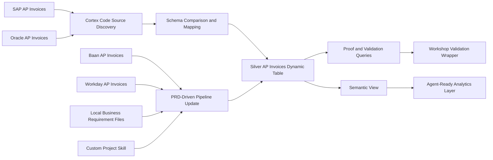

# Snowflake CoCo AI Data Pipeline

A Snowflake data engineering project demonstrating how Cortex Code (CoCo) can support source discovery, Dynamic Table development, local business-requirement analysis, reusable engineering skills, semantic modelling, and automated pipeline validation.

## Project Overview

This project was completed through the Snowflake CoCo Foundations workshop.

The implementation began with multiple accounts-payable invoice sources stored in Snowflake. Cortex Code was used through both Snowsight and the Windows CLI to inspect unfamiliar schemas, compare source-system structures, plan transformations, generate SQL, and build a trusted Silver-layer Dynamic Table.

The pipeline was later extended using local business-requirement files that introduced additional source systems and transformation rules. A semantic view was also created to prepare the curated data for natural-language analytics and future AI-agent use cases.

The completed implementation passed the final Snowflake validation wrapper and returned:

```text
Congratulations! You have successfully completed the Cortex Code Foundations workshop!
```

## Architecture



## What I Built

### 1. Snowflake workshop environment

Created the Snowflake resources required for the project, including:

- `COCO_WORKSHOP` database
- `SOURCE_DATA` schema
- `PIPELINE_LAB` schema
- Workshop virtual warehouse
- Sample accounts-payable invoice tables
- Workshop validation objects

Setup files:

```text
sql/00_setup/
├── 00_snowday_setup.sql
└── 00_sample_data.sql
```

### 2. Cortex Code CLI workflow

Installed and configured Cortex Code on Windows and connected the CLI to Snowflake.

The CLI was used to:

- Inspect available Snowflake databases
- Discover unfamiliar source tables
- Compare SAP and Oracle invoice schemas
- Generate transformation plans
- Review SQL before execution using Plan Mode
- Work with local project files
- Use bundled and project-level skills

### 3. Silver-layer Dynamic Table

Created:

```text
COCO_WORKSHOP.PIPELINE_LAB.SILVER_AP_INVOICES
```

The Silver layer combines invoice data from different enterprise systems into a common analytical structure.

The implementation included:

- Source-system identification
- Column-name alignment
- Datatype normalisation
- Common field mapping
- Dynamic Table creation
- Reusable source-count validation

Files:

```text
sql/01_pipeline/
├── 01_silver_ap_invoices.sql
└── 02_silver_ap_invoices_proof.sql
```

### 4. PRD-driven pipeline update

Local business-requirement files were used to extend the pipeline beyond the original SAP and Oracle sources.

The update introduced:

- Baan invoice data
- Workday invoice data
- Source-to-Silver column mappings
- Business-rule evaluation
- Assumption and open-question tracking
- Validation queries for the updated pipeline

Updated pipeline file:

```text
sql/01_pipeline/03_silver_ap_invoices_prd_update.sql
```

Requirement files:

```text
requirements/
├── sample_business_requirements_source_onboarding.csv
├── sample_business_requirements_column_mapping.csv
└── sample_business_requirements_business_rules.csv
```

### 5. Reusable Cortex Code project skill

A project-level Cortex Code skill was created under:

```text
.cortex/skills/
```

The skill supports a repeatable workflow for evaluating PRD-style files and preparing changes for a target Dynamic Table.

The workflow is designed to return:

- Requested-change summary
- Source-to-target mappings
- Assumptions and open questions
- DDL change plan
- Post-implementation validation queries

This demonstrates how repeated engineering processes can be converted into reusable project-level AI workflows instead of relying on one-off prompts.

### 6. Semantic modelling

Created a semantic view definition for the curated AP invoice data.

File:

```text
sql/02_agent/04_sv_ap_analytics.sql
```

The semantic layer prepares the pipeline for natural-language analytics such as:

- Total AP spend by vendor
- Monthly invoice counts
- Business-unit analysis
- Unpaid invoice analysis
- Vendor ranking

This creates an agent-ready interface over the trusted Silver-layer dataset.

### 7. Automated validation

The final validation script checked the required workshop objects and pipeline outcomes.

Validation areas included:

- Workshop database
- Required schemas
- Source-data tables
- Silver Dynamic Table
- Expected record count
- Records from all configured source systems
- Semantic modelling objects
- End-to-end workshop completion

Validation file:

```text
sql/03_validation/05_workshop_validation.sql
```

## Final Validation Result

| Status |
|---|
| Congratulations! You have successfully completed the Cortex Code Foundations workshop! |


## Technical Stack

| Technology | Purpose |
|---|---|
| Snowflake | Cloud data platform |
| Snowflake Cortex Code | AI-assisted engineering and SQL development |
| SQL | Environment setup, transformation, modelling, and validation |
| Dynamic Tables | Automatically refreshed Silver-layer pipeline |
| PowerShell | Windows CLI installation and execution |
| CSV | Local business-requirement inputs |
| Semantic Views | Business-friendly analytical modelling |
| GitHub | Source control, evidence, and technical documentation |

## Repository Structure

```text
.
├── README.md
│
├── sql/
│   ├── 00_setup/
│   │   ├── 00_snowday_setup.sql
│   │   └── 00_sample_data.sql
│   │
│   ├── 01_pipeline/
│   │   ├── 01_silver_ap_invoices.sql
│   │   ├── 02_silver_ap_invoices_proof.sql
│   │   └── 03_silver_ap_invoices_prd_update.sql
│   │
│   ├── 02_agent/
│   │   └── 04_sv_ap_analytics.sql
│   │
│   └── 03_validation/
│       └── 05_workshop_validation.sql
│
├── requirements/
│   ├── sample_business_requirements_source_onboarding.csv
│   ├── sample_business_requirements_column_mapping.csv
│   └── sample_business_requirements_business_rules.csv
│
├── prompts/
│   └── Saved Cortex Code prompts
│
├── notes/
│   └── Pipeline runbooks, change plans, and engineering handoff notes
│
├── .cortex/
│   └── skills/
│       └── Project-level PRD evaluation skill
│
└── docs/
    └── screenshots/
        └── final-validation-success.png
```

## Implementation Flow

```text
1. Run 00_snowday_setup.sql
2. Run 00_sample_data.sql
3. Connect Cortex Code CLI to Snowflake
4. Discover and compare the source schemas
5. Create SILVER_AP_INVOICES
6. Run the source-system proof query
7. Analyse the local business-requirement files
8. Extend the pipeline for Baan and Workday
9. Create the semantic view
10. Run 05_workshop_validation.sql
```

## Data Engineering Concepts Demonstrated

- AI-assisted data engineering
- Source-system discovery
- Schema comparison
- Data normalisation
- Dynamic Tables
- Silver-layer modelling
- Multi-source pipeline integration
- Local file analysis
- PRD-driven engineering changes
- Reusable custom AI skills
- Semantic modelling
- Data-quality validation
- Engineering handoff documentation
- GitHub project organisation

## Key Learning Outcomes

Through this project, I gained practical experience with:

- Using Cortex Code through Snowsight and the CLI
- Connecting local engineering workflows to Snowflake
- Reviewing AI-generated execution plans before applying changes
- Combining multiple enterprise source systems into a shared data model
- Turning business-requirement documents into structured pipeline changes
- Creating reusable AI-assisted engineering workflows
- Building an agent-ready semantic layer
- Validating an end-to-end implementation with automated SQL checks

## Security

No Snowflake credentials, passwords, access tokens, private keys, or local connection configuration files are included in this repository.

Files such as the following must remain local:

```text
config.toml
connections.toml
.env
private keys
access tokens
```

## Project Context

This project was completed in a controlled Snowflake workshop environment.

It demonstrates my implementation, technical understanding, project organisation, validation process, and ability to document a complete data engineering workflow. It should not be interpreted as an independently deployed enterprise production system.

## Acknowledgements

This implementation was completed through the Snowflake CoCo Foundations workshop using Snowflake-provided sample data and learning resources.
