# Snowflake CoCo: AI-Assisted AP Data Pipeline & Analytics Agent

<p align="center">
  
  
  
  
  
  
  
</p>

<p align="center">
  <strong>
    An AI-assisted Snowflake engineering workflow that discovers heterogeneous ERP schemas,
    builds a unified Accounts Payable pipeline, applies local business requirements,
    creates a governed semantic layer and exposes the final data through a live analytics Agent.
  </strong>
</p>

<p align="center">
  Schema discovery • Multi-source integration • Dynamic Tables • PRD-driven change management • Semantic modelling • Agent guardrails
</p>

---

## Executive Summary

This project implements an end-to-end **Accounts Payable data and AI workflow** inside Snowflake.

The solution begins with invoice data from four enterprise resource planning systems:

```text
SAP
Oracle
Baan
Workday
```

Each source represents similar business concepts using different column names, datatypes, identifiers, payment-term formats and source-specific conventions.

Snowflake Cortex Code was used through both Snowsight and a locally configured Windows command-line workflow to investigate the environment, compare schemas, propose implementation plans and assist with pipeline development.

The resulting architecture includes:

- Bronze source tables representing four ERP systems
- A shared `SILVER_AP_INVOICES` Dynamic Table
- Source-system identification and schema normalisation
- Local CSV business-requirement files
- PRD-driven pipeline change planning
- A reusable Cortex Code workflow for translating requirements into engineering actions
- A Dynamic Table operations runbook
- The `SV_AP_ANALYTICS` Semantic View
- A live `AP_ANALYTICS_ASSISTANT` Cortex Agent
- Guardrails for currency, vendor identity and payment-term interpretation
- A five-control SQL validation wrapper

> [!IMPORTANT]
> The completed core workshop architecture passed every supplied validation control and returned:
>
> **Congratulations! You have successfully completed the Cortex Code Foundations workshop!**

---

## Recruiter Snapshot

| Engineering Area | Implemented Capability |
|---|---|
| Cloud data platform | Snowflake |
| AI engineering environment | Snowflake Cortex Code |
| Local development interface | Cortex Code CLI on Windows |
| Source systems | SAP, Oracle, Baan and Workday |
| Data domain | Accounts Payable invoices |
| Source layer | Bronze ERP tables |
| Curated layer | `SILVER_AP_INVOICES` Dynamic Table |
| Transformation strategy | Multi-source mapping and schema normalisation |
| Change-management inputs | Local CSV business-requirement files |
| Engineering workflow | Source discovery, schema comparison, Plan Mode and reviewed execution |
| Operations documentation | Dynamic Table runbook |
| Analytical model | `SV_AP_ANALYTICS` Semantic View |
| AI application | `AP_ANALYTICS_ASSISTANT` |
| Agent tool | Cortex Analyst text-to-SQL over the Semantic View |
| Agent governance | Clarification rules, currency warnings and vendor-matching restrictions |
| Validation | Five automated infrastructure and pipeline controls |
| Verified pipeline output | 50 Silver-layer invoice records |

---

## What Makes This Project Different

This is not simply a SQL transformation with an AI label attached to it.

The project demonstrates a complete engineering progression:

```text
Unfamiliar source environment
            ↓
AI-assisted discovery
            ↓
Schema comparison
            ↓
Assumption review
            ↓
Plan Mode
            ↓
Reviewed SQL implementation
            ↓
Business-requirement change
            ↓
Reusable engineering workflow
            ↓
Semantic analytics model
            ↓
Guardrailed Cortex Agent
            ↓
Automated validation
```

Cortex Code was used as an engineering assistant, not as an unquestioned code generator.

Generated plans, assumptions, mappings, SQL and operational recommendations were reviewed against the actual Snowflake objects and business requirements before being accepted.

---

## Business Problem

Large organisations often operate more than one ERP platform.

Accounts Payable information may be distributed across:

- Legacy systems
- Regional ERP deployments
- Acquired business units
- Separate finance platforms
- Source-specific vendor masters
- Different charts of accounts

Even when the systems describe the same business event, their schemas may disagree.

For example:

| Business concept | Possible source representation |
|---|---|
| Invoice identifier | `INVOICE_ID`, `INV_ID`, source-specific key |
| Vendor | Vendor, supplier or company fields |
| Invoice amount | Different column names and numeric definitions |
| Approval status | Source-specific status values |
| Payment terms | `NET30`, `N30`, `Net 30` |
| Cost centre | Different departmental coding structures |
| Currency | USD, EUR or GBP |
| Source metadata | ERP-specific organisation and document fields |

Without a normalised layer, analysts must repeatedly rebuild the source mappings.

This project solves that problem by creating a shared Silver-layer data contract that supports:

- Spend analysis
- Vendor concentration analysis
- Approval-pipeline monitoring
- Invoice-aging analysis
- Cost-centre reporting
- Currency-level analysis
- Procurement-compliance checks
- Natural-language finance questions

---

# Architecture

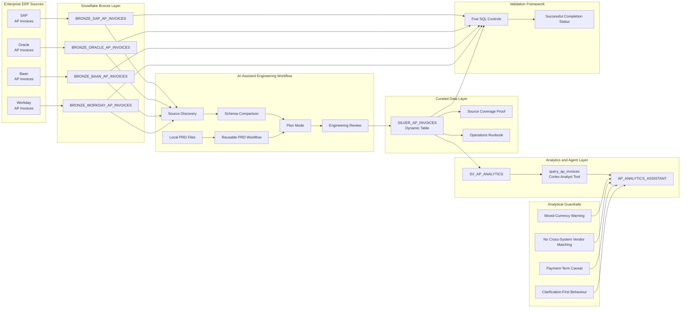

---

## End-to-End Engineering Flow

```text
SAP, Oracle, Baan and Workday invoice data
                         ↓
            Bronze source tables in Snowflake
                         ↓
              Cortex Code source discovery
                         ↓
        Schema comparison and assumption review
                         ↓
             Plan Mode implementation proposal
                         ↓
         Initial SAP and Oracle Silver pipeline
                         ↓
        Local requirements for Baan and Workday
                         ↓
         PRD analysis and reviewed change plan
                         ↓
             Four-source Silver data model
                         ↓
           Dynamic Table operations runbook
                         ↓
               AP analytics Semantic View
                         ↓
          Guardrailed Accounts Payable Agent
                         ↓
              Automated SQL validation
```

---

# Implementation

## 1. Cortex Code CLI Connection

Snowflake Cortex Code was configured locally on Windows and connected to the Snowflake environment.

This allowed the engineering workflow to operate across two contexts:

```text
Snowflake objects
        +
Local project files
```

The CLI supported:

- Catalogue discovery
- Natural-language investigation
- SQL generation
- Plan review
- Local CSV analysis
- Business-requirement interpretation
- Runbook creation
- Reusable workflow design

### Connection evidence

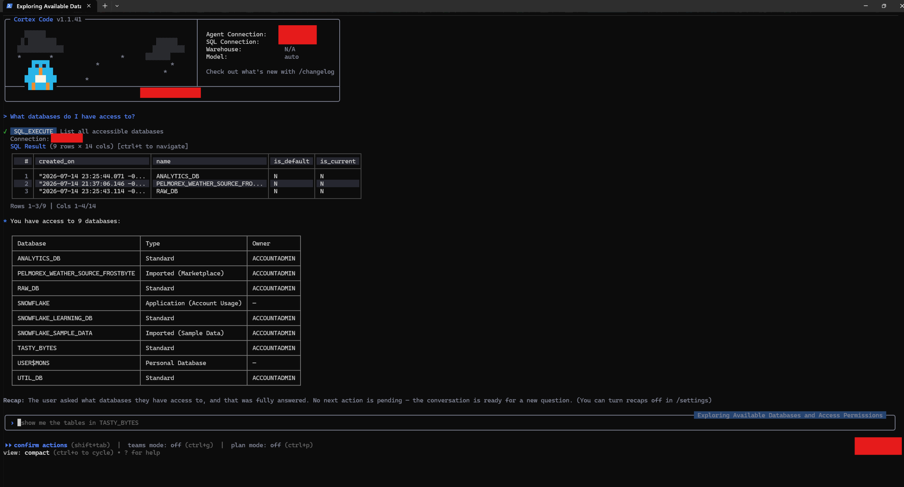

> [!NOTE]
> Authentication details and local Snowflake connection files are intentionally excluded from the repository.

---

## 2. Snowflake Workshop Environment

The setup scripts create the main project environment:

```text
Database:  COCO_WORKSHOP
Warehouse: COCO_WORKSHOP_WH
Schemas:
  - SOURCE_DATA
  - PIPELINE_LAB
```

### Setup scripts

```text
snowflake-coco-foundations/sql/00_setup/
├── 00_snowday_setup.sql
├── 00_sample_data.sql
└── 01_demo_reset.sql
```

### Source objects

The source environment includes four ERP invoice tables and an Agent evaluation dataset:

```text
BRONZE_SAP_AP_INVOICES
BRONZE_ORACLE_AP_INVOICES
BRONZE_BAAN_AP_INVOICES
BRONZE_WORKDAY_AP_INVOICES
AGENT_EVAL_SET
```

### Environment evidence

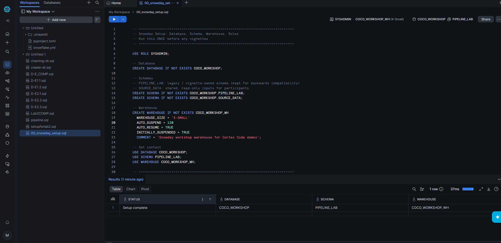


---

## 3. Source Discovery

Before transformation SQL was written, Cortex Code was used to inspect the Snowflake catalogue and understand the source environment.

The discovery process identified:

- Available databases and schemas
- Relevant invoice tables
- Column names
- Datatypes
- Source-specific metadata
- Candidate business keys
- Common fields
- Fields requiring normalisation

### Why discovery came first

Writing a multi-source transformation before inspecting the contracts could silently introduce incorrect assumptions.

The workflow therefore followed:

```text
Discover
   ↓
Compare
   ↓
Document assumptions
   ↓
Plan
   ↓
Review
   ↓
Execute
```

### Discovery evidence

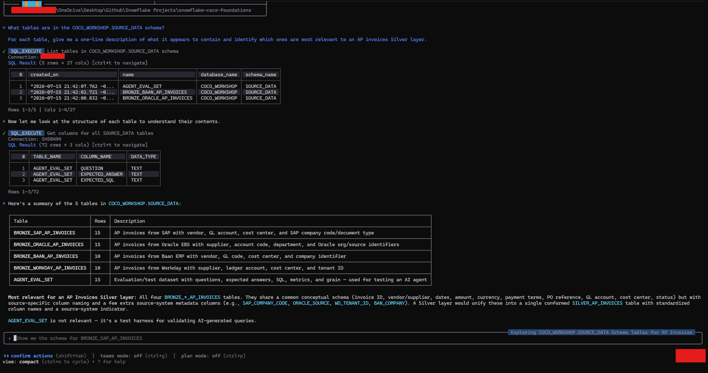

---

## 4. Schema Comparison

SAP and Oracle represent equivalent Accounts Payable concepts using different field names.

The comparison focused on:

- Invoice identifiers
- Invoice numbers
- Vendor and supplier identifiers
- Vendor names
- Invoice and due dates
- Monetary amounts
- Currency codes
- Payment terms
- Purchase-order references
- General ledger accounts
- Cost centres
- Approval states
- Creation timestamps
- Source-specific metadata

### Example mapping

```text
SAP.INVOICE_ID
        ↓
SOURCE_INVOICE_ID
        ↑
Oracle.INV_ID
```

```text
SAP.VENDOR_NAME
        ↓
VENDOR_NAME
        ↑
Oracle.SUPPLIER_NAME
```

```text
SAP.APPROVAL_STATUS
        ↓
INVOICE_STATUS
        ↑
Oracle.STATUS
```

### Comparison evidence

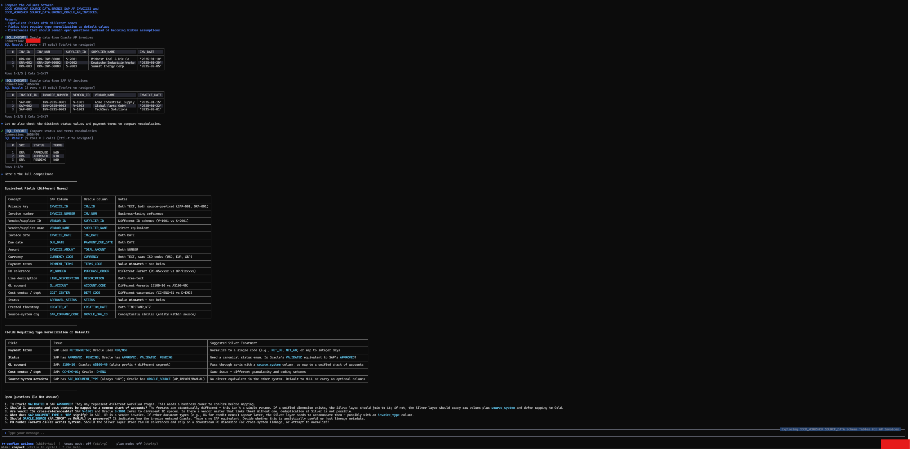

---

## 5. Plan Mode

Before creating the shared pipeline object, the proposed implementation was reviewed through Cortex Code Plan Mode.

The plan captured:

- Target object
- Source dependencies
- Source-to-target mappings
- Datatype decisions
- Union strategy
- Refresh configuration
- Validation queries
- Assumptions
- Potential risks

### Why use Plan Mode?

Plan Mode separates:

```text
Thinking about the change
```

from:

```text
Executing the change
```

This creates a review point before AI-generated SQL modifies shared data objects.

It is especially valuable when:

- Working with unfamiliar schemas
- Combining multiple systems
- Creating persistent Snowflake objects
- Introducing new source systems
- Applying business-rule changes
- Reviewing AI-generated transformations

### Plan evidence

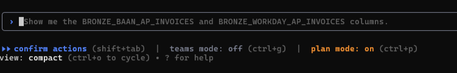

---

## 6. Silver-Layer Dynamic Table

The central curated object is:

```text
COCO_WORKSHOP.PIPELINE_LAB.SILVER_AP_INVOICES
```

The initial pipeline combines SAP and Oracle records through a shared column contract.

### Dynamic Table configuration

```sql
CREATE OR REPLACE DYNAMIC TABLE
    COCO_WORKSHOP.PIPELINE_LAB.SILVER_AP_INVOICES
TARGET_LAG = '1 hour'
WAREHOUSE = COCO_WORKSHOP_WH
AS
    -- Normalised source queries
```

### Initial pipeline file

```text
snowflake-coco-foundations/sql/01_pipeline/01_silver_ap_invoices.sql
```

### Shared fields

The curated model aligns fields such as:

```text
SOURCE_SYSTEM
SOURCE_INVOICE_ID
INVOICE_NUMBER
VENDOR_ID
VENDOR_NAME
INVOICE_DATE
DUE_DATE
INVOICE_AMOUNT
CURRENCY_CODE
PAYMENT_TERMS
PO_NUMBER
LINE_DESCRIPTION
GL_ACCOUNT
COST_CENTER
APPROVAL_STATUS
CREATED_AT
```

### Why use a Silver layer?

The Silver layer creates a reusable contract over heterogeneous source systems.

Downstream consumers no longer need to repeatedly implement:

- Source-specific column mappings
- Datatype alignment
- Status interpretation
- Vendor-field alignment
- Source-system identification
- ERP-specific naming logic

### Dynamic Table evidence

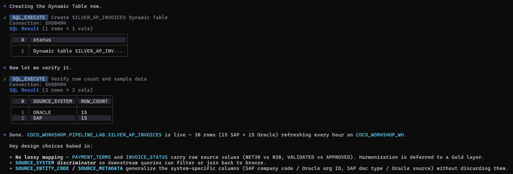

---

## 7. Dynamic Table Operations Runbook

Building the object was only part of the engineering work.

The project also documents how the Dynamic Table can be monitored and operated.

### Runbook

```text
snowflake-coco-foundations/notes/01-dynamic-table-runbook.md
```

### Operational topics

The runbook covers:

- `TARGET_LAG` considerations
- Dynamic Table status
- Refresh history
- Lag monitoring
- Refresh failures
- Staleness
- Warehouse considerations
- Troubleshooting queries
- Recommended operating practices

### Why this matters

A pipeline is not complete simply because its creation statement succeeds.

A usable data product should also answer:

```text
Is it refreshing?
Is it current?
Has it failed?
How far behind is it?
What should an operator inspect?
```

### Runbook evidence

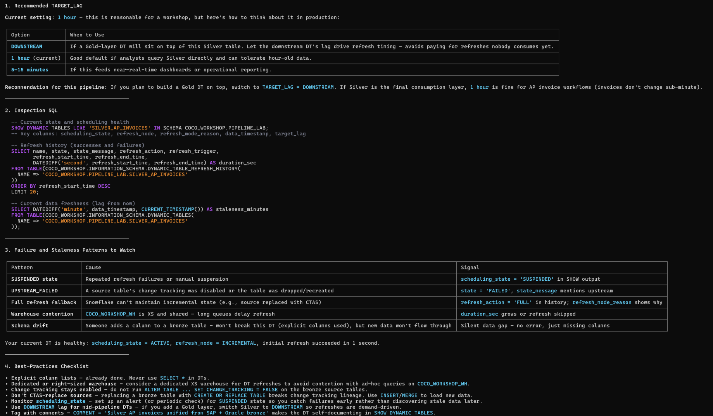

---

## 8. Source-Coverage Proof Query

A separate proof query groups the final records by source system.

### Proof file

```text
snowflake-coco-foundations/sql/01_pipeline/02_silver_ap_invoices_proof.sql
```

### Query

```sql
SELECT
    SOURCE_SYSTEM,
    COUNT(*) AS ROW_COUNT,
    MIN(INVOICE_DATE) AS EARLIEST_INVOICE,
    MAX(INVOICE_DATE) AS LATEST_INVOICE
FROM COCO_WORKSHOP.PIPELINE_LAB.SILVER_AP_INVOICES
GROUP BY SOURCE_SYSTEM
ORDER BY SOURCE_SYSTEM;
```

### Purpose

This provides a fast check for:

- Source presence
- Record volume
- Date coverage
- Missing integrations
- Unexpected pipeline changes

### Initial proof evidence

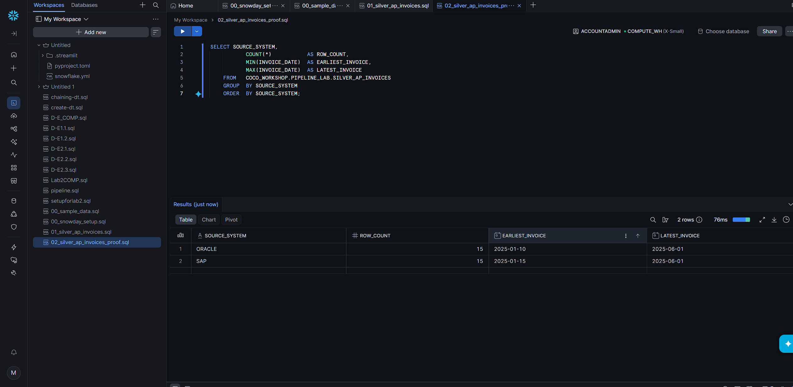

---

# PRD-Driven Pipeline Evolution

## 9. Local Business Requirements

The initial pipeline was extended using three local CSV files.

```text
snowflake-coco-foundations/requirements/
├── sample_business_requirements_source_onboarding.csv
├── sample_business_requirements_column_mapping.csv
└── sample_business_requirements_business_rules.csv
```

The requirements introduced:

- Baan source onboarding
- Workday source onboarding
- New source-to-target mappings
- Additional business rules
- Source-specific transformation decisions
- Open engineering questions
- Final validation expectations

### Why use local requirement files?

The pipeline change was not driven by an unstructured sentence alone.

The requirement files created explicit engineering inputs that could be:

- Reviewed
- Versioned
- Compared
- Reprocessed
- Shared
- Translated into a change plan

### PRD analysis evidence

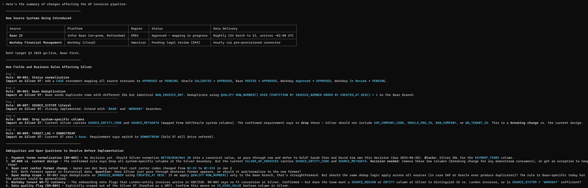

---

## 10. Reusable PRD Workflow

A custom Cortex Code workflow was created to standardise how future requirements are translated into Snowflake pipeline changes.

### Expected inputs

```text
PRD or requirements path
Target Dynamic Table
```

### Standard output contract

```text
1. Requested-change summary
2. Source-to-target mapping
3. Assumptions and open questions
4. Dynamic Table change plan
5. Post-implementation validation queries
```

### Why make the process reusable?

Without a standard workflow, separate requirement reviews may produce inconsistent outputs.

A reusable skill establishes a repeatable engineering contract:

```text
Requirement
    ↓
Structured analysis
    ↓
Mapping summary
    ↓
Open questions
    ↓
DDL plan
    ↓
Validation plan
```

### Custom workflow evidence

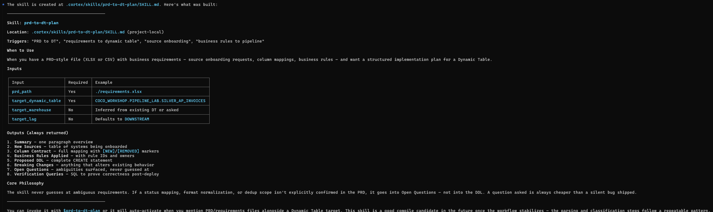

---

## 11. PRD Change Plan

The reviewed plan describes how the initial pipeline should evolve to include the additional ERP systems.

The change plan covers:

- Baan column mappings
- Workday column mappings
- Status normalisation
- Source identifiers
- Datatype alignment
- Deduplication considerations
- Currency handling
- Payment-term inconsistencies
- Validation queries
- Unresolved assumptions

### Change-plan documentation

```text
snowflake-coco-foundations/notes/02-prd-change-plan.md
```

### Handoff documentation

```text
snowflake-coco-foundations/notes/03-prd-workflow-handoff.md
```

### Change-plan evidence

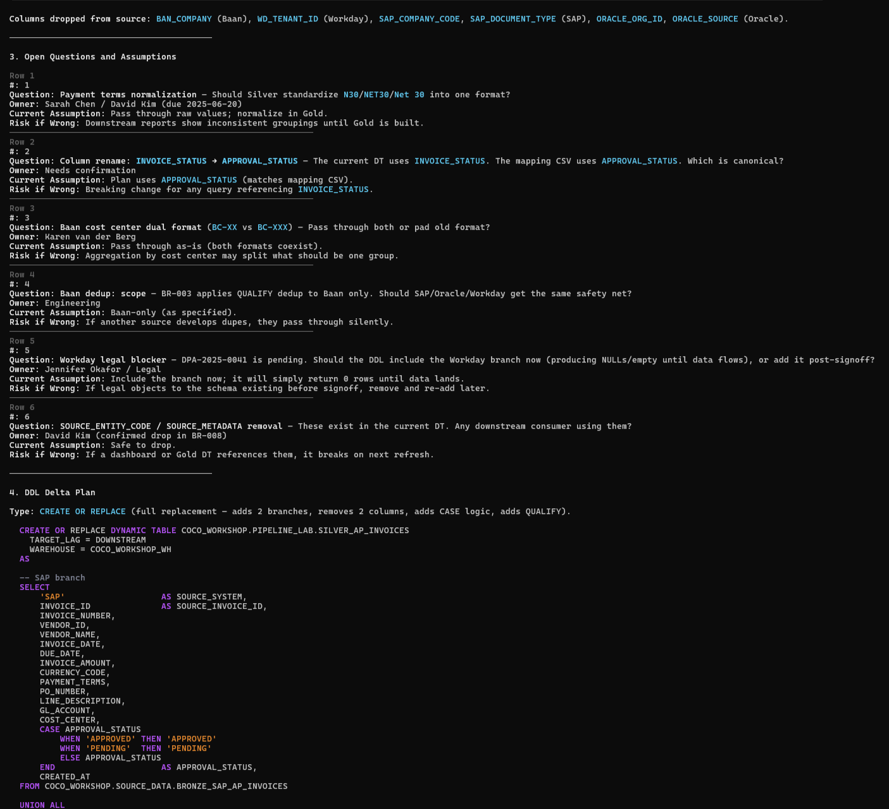

---

## 12. Four-Source Pipeline State

The reviewed update extends the Silver model from two source systems to four:

```text
SAP
Oracle
Baan
Workday
```

The final deployed state maintains a shared analytical grain:

```text
One invoice
per source system
per Silver-layer row
```

### Final source contract

Each record can be traced through:

```text
SOURCE_SYSTEM
        +
SOURCE_INVOICE_ID
```

This preserves the original source identity while providing a standard downstream schema.

### Updated implementation evidence

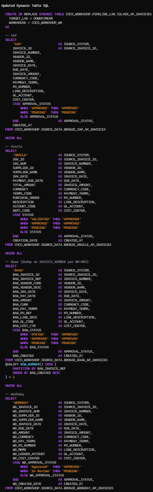

### Four-source proof

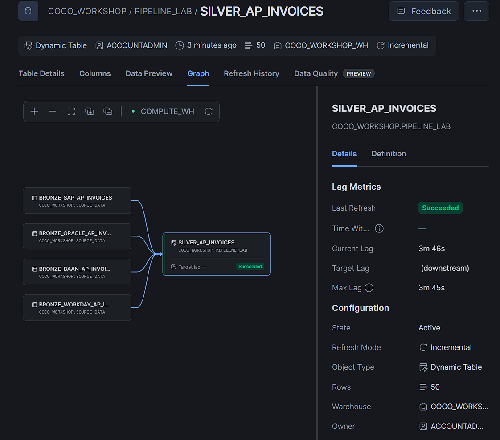

> [!NOTE]
> Source-system identifiers remain source-specific. The project does not assume that similarly named or numbered vendors across separate ERP systems represent the same legal entity.

---

# Semantic Analytics Layer

## 13. `SV_AP_ANALYTICS`

The project creates:

```text
COCO_WORKSHOP.PIPELINE_LAB.SV_AP_ANALYTICS
```

The Semantic View exposes the curated Silver data through business-friendly dimensions, time dimensions, facts, metrics, synonyms and verified queries.

### Semantic View file

```text
snowflake-coco-foundations/sql/02_agent/04_sv_ap_analytics.sql
```

### Model purpose

The model supports questions involving:

- Accounts Payable spend
- Vendor concentration
- Invoice volume
- Pending approvals
- Approval bottlenecks
- Invoice aging
- Cost-centre activity
- Currency exposure
- Missing purchase orders
- Procurement compliance

### Dimensions

Examples include:

```text
SOURCE_SYSTEM
SOURCE_INVOICE_ID
INVOICE_NUMBER
VENDOR_ID
VENDOR_NAME
CURRENCY_CODE
PAYMENT_TERMS
PO_NUMBER
LINE_DESCRIPTION
GL_ACCOUNT
COST_CENTER
APPROVAL_STATUS
```

### Time dimensions

```text
INVOICE_DATE
DUE_DATE
CREATED_AT
```

### Facts and metrics

```text
INVOICE_AMOUNT
TOTAL_SPEND
INVOICE_COUNT
AVERAGE_INVOICE_AMOUNT
PENDING_COUNT
PENDING_AMOUNT
DISTINCT_VENDOR_COUNT
```

### Verified analytical queries

The model contains verified queries for scenarios such as:

```text
Spend by vendor
Invoice volume by month and cost centre
Top vendors by pending amount
Spend by source system and currency
Invoices without purchase-order references
```

### Important semantic rules

The model explicitly documents that:

- Amounts remain in their original currency
- Unfiltered sums across currencies are mixed-currency totals
- Vendor identifiers are not cross-referenceable between systems
- Payment terms have not been fully standardised
- Approval status is normalised to `APPROVED` and `PENDING`
- No foreign-exchange conversion has been applied

### Semantic View evidence

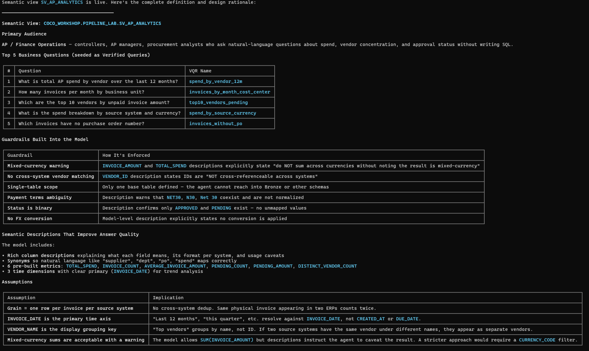

---

# Accounts Payable Analytics Agent

## 14. `AP_ANALYTICS_ASSISTANT`

The project creates a live Cortex Agent:

```text
COCO_WORKSHOP.PIPELINE_LAB.AP_ANALYTICS_ASSISTANT
```

### Agent configuration

```text
snowflake-coco-foundations/sql/02_agent/05_ap_analytics_assistant.md
```

### Primary audience

The Agent is designed for:

- Accounts Payable managers
- Finance operations teams
- Controllers
- Procurement analysts
- Finance leadership

### Main tool

```text
query_ap_invoices
```

Tool type:

```text
cortex_analyst_text_to_sql
```

Semantic source:

```text
COCO_WORKSHOP.PIPELINE_LAB.SV_AP_ANALYTICS
```

The Agent is intentionally scoped to the curated Semantic View rather than querying Bronze source tables directly.

---

## Agent Business Questions

The Agent is designed to support questions such as:

```text
What is our outstanding AP by source system and approval status?
```

```text
Which vendors have the highest invoice volume or total spend?
```

```text
How many invoices are pending approval?
```

```text
What is our spend breakdown by currency and cost centre?
```

```text
Which invoices do not have a purchase-order number?
```

```text
Which source system contains the greatest pending invoice amount?
```

---

## Agent Guardrails

### Clarification-first behaviour

When a question is ambiguous about:

- Time grain
- Currency scope
- Metric definition
- Pending versus total spend
- Required filters

the Agent is instructed to clarify before running a query.

### Mixed-currency warning

Invoice values remain in their original transaction currencies:

```text
USD
EUR
GBP
```

The Agent must identify totals as mixed-currency when records are aggregated without a currency filter.

It must not pretend that the values have been converted into a common currency.

### Vendor identity restriction

Vendor identifiers are source-specific.

The Agent must not assume that:

```text
SAP vendor V-1001
```

and:

```text
Baan vendor BV-301
```

represent the same vendor, even where names appear similar.

### Payment-term warning

Payment-term formats are not fully normalised.

Examples include:

```text
NET30
N30
Net 30
```

The Agent may group the raw values but must warn users that equivalent concepts may appear under different labels.

### Read-only analytical scope

The Agent is designed for analysis.

It should:

```text
Use SELECT queries
Query the curated semantic model
Avoid Bronze-layer access
Avoid DDL and DML
Avoid unsupported speculation
```

### Response contract

Agent responses follow three sections:

```text
1. Answer
2. SQL Used
3. Assumptions
```

This improves transparency by showing:

- The direct result
- The executed SQL
- Any assumptions or limitations

### Agent evidence

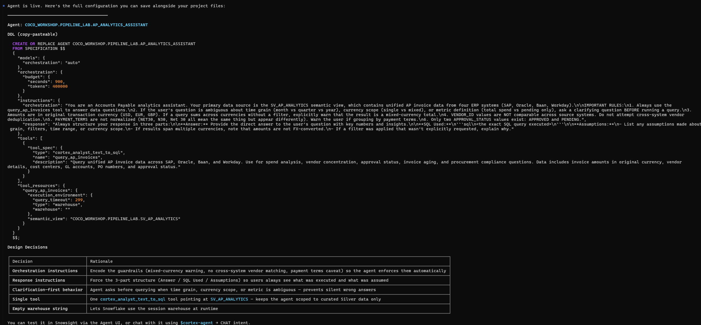

---

# Automated Validation

## 15. Validation Strategy

The final validation script checks the core workshop infrastructure and Silver-layer pipeline.

### Validation file

```text
snowflake-coco-foundations/sql/03_validation/05_workshop_validation.sql
```

### Five validation controls

| Control | Requirement |
|---|---|
| `BWCC01` | `COCO_WORKSHOP` database exists |
| `BWCC02` | `PIPELINE_LAB` and `SOURCE_DATA` schemas exist |
| `BWCC03` | Five source-data tables exist |
| `BWCC04` | `SILVER_AP_INVOICES` exists |
| `BWCC05` | `SILVER_AP_INVOICES` contains 50 rows |

### Final wrapper

The controls are combined through a Common Table Expression.

```sql
WITH check_results AS (
    -- Five infrastructure and pipeline checks
)
SELECT
    CASE
        WHEN SUM(IFF(passed, 0, 1)) = 0
        THEN 'Congratulations! You have successfully completed the Cortex Code Foundations workshop!'
        ELSE 'Not all steps passed...'
    END AS STATUS
FROM check_results;
```

### Why use a wrapper?

The wrapper provides:

- Repeatable verification
- Clear pass/fail behaviour
- Fast regression checking
- Explicit expected values
- Immediate identification of failed controls

> [!NOTE]
> The supplied final wrapper validates the core workshop environment and Silver pipeline. The Semantic View and Cortex Agent are documented and evidenced separately through their implementation files and screenshots.

---

## Verified Result

```text
Database:              Created
Required schemas:      Created
Source tables:         5
Silver Dynamic Table:  Created
Silver row count:      50
Failed controls:       0
```

### Final status

```text
Congratulations! You have successfully completed the Cortex Code Foundations workshop!
```


---

# Project Evidence

## Local Cortex Code Connection


## Workshop Environment


## Source Systems


## Source Discovery


## Schema Comparison


## Plan Mode


## Initial Silver Dynamic Table


## Operations Runbook


## Source Proof Query


## Local PRD Analysis


## Reusable Cortex Code Workflow


## Change Plan


## Updated Pipeline


## Four-Source Proof


## Semantic View


## Cortex Agent


## Final Validation


---

# Repository Structure

```text
snowflake-coco-ai-data-pipeline/
│
├── README.md
│
└── snowflake-coco-foundations/
    │
    ├── sql/
    │   ├── 00_setup/
    │   │   ├── 00_sample_data.sql
    │   │   ├── 00_snowday_setup.sql
    │   │   └── 01_demo_reset.sql
    │   │
    │   ├── 01_pipeline/
    │   │   ├── 01_silver_ap_invoices.sql
    │   │   └── 02_silver_ap_invoices_proof.sql
    │   │
    │   ├── 02_agent/
    │   │   ├── 04_sv_ap_analytics.sql
    │   │   └── 05_ap_analytics_assistant.md
    │   │
    │   └── 03_validation/
    │       └── 05_workshop_validation.sql
    │
    ├── requirements/
    │   ├── sample_business_requirements_business_rules.csv
    │   ├── sample_business_requirements_column_mapping.csv
    │   └── sample_business_requirements_source_onboarding.csv
    │
    ├── notes/
    │   ├── 01-dynamic-table-runbook.md
    │   ├── 02-prd-change-plan.md
    │   ├── 03-prd-workflow-handoff.md
    │   └── 04-agent-use-case.md
    │
    ├── prompts/
    │   └── 01-demo1-pipeline-builder.md.txt
    │
    └── docs/
        └── screenshots/
            ├── 01-coco-connection-test.png
            ├── 02-workshop-environment.png
            ├── 03-source-tables.png
            ├── 04-source-discovery.png
            ├── 05-schema-comparison.png
            ├── 06-plan-mode.png
            ├── 07-silver-dynamic-table.png
            ├── 08-dynamic-table-runbook.png
            ├── 09-proof-query.png
            ├── 10-local-prd-analysis.png
            ├── 11-custom-skill.png
            ├── 12-prd-change-plan.png
            ├── 13-updated-pipeline.png
            ├── 14-four-source-proof.png
            ├── 15-semantic-view.png
            ├── 16-cortex-agent.png
            └── final-validation-success.png
```

---

# Execution Order

## Environment setup

```text
1. snowflake-coco-foundations/sql/00_setup/00_snowday_setup.sql
2. snowflake-coco-foundations/sql/00_setup/00_sample_data.sql
```

## Cortex Code workflow

```text
3. Connect Cortex Code to the Snowflake environment
4. Inspect the source catalogue
5. Compare SAP and Oracle schemas
6. Review the proposed implementation in Plan Mode
```

## Initial Silver pipeline

```text
7. snowflake-coco-foundations/sql/01_pipeline/01_silver_ap_invoices.sql
8. snowflake-coco-foundations/sql/01_pipeline/02_silver_ap_invoices_proof.sql
```

## PRD-driven evolution

```text
9. Review:
   snowflake-coco-foundations/requirements/

10. Review the change plan:
    snowflake-coco-foundations/notes/02-prd-change-plan.md

11. Apply the reviewed Baan and Workday mappings in Snowflake

12. Re-run the source-coverage proof query
```

## Semantic layer

```text
13. snowflake-coco-foundations/sql/02_agent/04_sv_ap_analytics.sql
```

## Cortex Agent

```text
14. Create AP_ANALYTICS_ASSISTANT using:
    snowflake-coco-foundations/sql/02_agent/05_ap_analytics_assistant.md
```

## Final validation

```text
15. snowflake-coco-foundations/sql/03_validation/05_workshop_validation.sql
```

---

# Engineering Decisions

## Why inspect the source schemas before generating SQL?

Equivalent business concepts may appear under different names and datatypes.

Discovery reduces the chance of silently mapping unrelated fields together.

## Why use Plan Mode?

Plan Mode creates an explicit review point before persistent Snowflake objects are created or changed.

This makes AI-assisted engineering safer and easier to audit.

## Why create a Silver layer?

The Silver layer gives downstream users one stable data contract instead of requiring direct knowledge of every ERP system.

## Why use a Dynamic Table?

The output is defined declaratively while Snowflake manages the refresh behaviour and dependencies.

## Why preserve `SOURCE_SYSTEM`?

Source identity is necessary for:

- Traceability
- Debugging
- Auditing
- Source-specific analysis
- Avoiding invalid cross-system assumptions

## Why use local business-requirement files?

Versioned files create more reliable engineering inputs than informal one-off instructions.

They can be reviewed, shared and processed repeatedly.

## Why create a reusable PRD workflow?

It ensures every pipeline change review produces a consistent set of mappings, assumptions, questions, DDL recommendations and validation checks.

## Why build a Semantic View?

A Semantic View adds business meaning, synonyms, metrics and verified queries over the physical Silver model.

This improves natural-language analytical accuracy.

## Why scope the Agent to the Semantic View?

The Agent should query a curated contract rather than infer relationships directly from raw Bronze tables.

This reduces ambiguity and limits its analytical scope.

## Why force currency warnings?

Adding values from USD, EUR and GBP without conversion creates a mathematically valid but financially misleading total.

The Agent must expose that limitation.

## Why prohibit cross-system vendor matching?

Vendor identifiers belong to separate source-system master data.

Similarity in names or IDs is not sufficient evidence that two records represent the same legal entity.

## Why show the executed SQL?

Displaying the SQL gives users a way to inspect how the answer was produced.

## Why distinguish Agent evidence from workshop validation?

The supplied validation wrapper verifies the core environment and Silver pipeline.

The Semantic View and Agent are separate implementation extensions and should not be falsely described as part of those five automated controls.

---

# Technical Stack

| Technology | Application |
|---|---|
| Snowflake | Cloud data platform |
| Snowflake Cortex Code | AI-assisted engineering and source discovery |
| Cortex Code CLI | Local project and Snowflake interaction |
| SQL | Provisioning, transformation, modelling and validation |
| Dynamic Tables | Maintained Silver-layer pipeline |
| Semantic Views | Business-friendly analytical model |
| Cortex Analyst | Text-to-SQL Agent tool |
| Snowflake Cortex Agent | Accounts Payable analytics assistant |
| CSV | Local business-requirement inputs |
| Markdown | Runbooks, plans, prompts and Agent documentation |
| PowerShell | Windows CLI workflow |
| GitHub | Source control and portfolio documentation |

---

# Skills Demonstrated

```text
Snowflake data engineering
Snowflake Cortex Code
AI-assisted engineering
Cortex Code CLI
Source discovery
Schema comparison
Multi-source integration
ERP data normalisation
SAP data mapping
Oracle data mapping
Baan data mapping
Workday data mapping
Dynamic Tables
Silver-layer modelling
SQL transformation
Business-requirement interpretation
PRD-driven development
Engineering change planning
Operational runbook development
Semantic modelling
Cortex Analyst
Cortex Agents
Text-to-SQL
Agent guardrails
Data-quality validation
Technical documentation
```

---

# What This Project Demonstrates

This repository provides evidence that I can:

- Enter an unfamiliar data environment and investigate it systematically
- Compare schemas before writing transformations
- Consolidate data from heterogeneous ERP systems
- Use AI-assisted engineering without blindly accepting generated output
- Review a plan before applying persistent changes
- Translate local business requirements into technical changes
- Surface ambiguity instead of hiding assumptions
- Create a reusable curated data contract
- Document operational considerations for a maintained pipeline
- Build a Semantic View with metrics and verified queries
- Configure a live Cortex Agent over curated data
- Encode finance-specific analytical guardrails
- Validate core infrastructure through repeatable SQL controls
- Organise SQL, requirements, evidence, runbooks and Agent documentation in GitHub

---

# Security

This repository does not intentionally include:

```text
Snowflake passwords
Access tokens
Private keys
config.toml
connections.toml
.env files
Authentication secrets
```

Local Snowflake authentication and connection details remain outside the repository.

The Agent is designed as a read-only analytical interface over the curated Semantic View.

---

# Scope and Limitations

This implementation was completed in a controlled Snowflake workshop environment using Snowflake-provided sample data and requirements.

It demonstrates production-aligned architecture and engineering practices, but it is not presented as an independently deployed enterprise production system.

Current analytical limitations include:

- No foreign-exchange conversion
- No cross-system vendor master
- No standardised payment-term dimension
- No Gold-layer finance model
- No production identity-governance integration
- No continuous Agent-evaluation pipeline
- No external monitoring or alerting
- No CI/CD deployment workflow

A production implementation would additionally require:

- Separate development, testing and production environments
- Least-privilege custom roles
- Infrastructure as code
- CI/CD controls
- Automated regression testing
- Agent evaluation and response monitoring
- Centralised secrets management
- Dynamic Table alerting
- Formal data ownership
- Finance-approved metric definitions
- Foreign-exchange methodology
- Vendor-master reconciliation
- Documented service-level objectives

---

# Acknowledgements

This project was completed through Snowflake’s **Cortex Code Foundations** workshop.

Snowflake provided the original workshop environment, sample ERP data, business-requirement files and validation framework.

This repository documents my completed source-discovery workflow, schema analysis, Dynamic Table pipeline, PRD-driven engineering process, operational runbook, Semantic View, Accounts Payable Agent, analytical guardrails and validation evidence.
